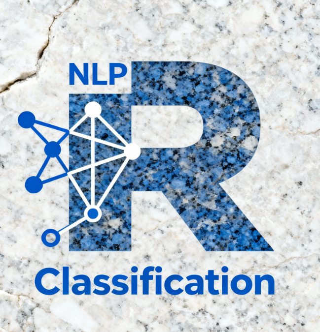

# graniteR 

<!-- badges: start -->
[](https://github.com/skandermulder/graniteR/actions/workflows/R-CMD-check.yaml)
[](https://lifecycle.r-lib.org/articles/stages.html#experimental)
[](https://opensource.org/licenses/MIT)
<!-- badges: end -->

R interface for text embeddings and classification using transformer encoder models. Designed as a homage to [IBM's Granite Embedding R2](https://arxiv.org/html/2508.21085v1) (149M parameters, ModernBERT with Flash Attention), but compatible with any Hugging Face transformer encoder model.

**Transfer Learning**: Classification uses frozen pretrained models with trainable classification heads only. This provides fast, efficient training while preserving pretrained knowledge.

**Privacy**: All models execute locally. No data transmission to external servers.

> **Note**: While optimized for Granite models, this package works with other encoder models (BERT, RoBERTa, DistilBERT, etc.) by specifying `model_name` in function calls.

## Installation

```r
# Install package
devtools::install_github("skandermulder/graniteR")

# Install Python dependencies (uses UV - completes in 1-2 minutes)
library(graniteR)
install_pyenv()
```

## Quick Start

**Embeddings:**
```r
library(graniteR)
library(dplyr)

tibble(text = c("positive", "negative")) |>
  embed(text)  # 768-dimensional dense vectors
```

**Binary Classification:**
```r
train <- tibble(
  text = c("I love this", "terrible", "great", "poor"),
  label = c(1, 0, 1, 0)
)

clf <- classifier(num_labels = 2) |>
  train(train, text, label, epochs = 3)

predict(clf, tibble(text = c("excellent", "bad")), text)
```

**Multi-Class Classification:**
```r
train <- tibble(
  text = c("urgent issue", "routine request", "critical failure", "minor bug"),
  priority = c("high", "low", "critical", "medium")
)

clf <- classifier(num_labels = 4) |>
  train(train, text, priority, epochs = 5)

# Returns class predictions or probability distributions
predict(clf, new_data, text, type = "class")
predict(clf, new_data, text, type = "prob")
```

## Features

- **Transfer learning**: Frozen pretrained models with trainable classification heads for efficient training
- **Local execution**: All inference runs on-device, ensuring data privacy
- **Mixture of Experts (MoE)**: Multiple specialized expert networks with gating for complex classification tasks
- **Multi-class support**: Binary and n-class classification with softmax output
- **Fast dependency installation**: UV package manager (1-2 min vs 10-20 min with pip)
- **GPU acceleration**: Automatic CUDA detection with CPU fallback
- **Training monitoring**: Real-time loss and validation accuracy tracking
- **Flexible prediction**: Class labels or probability distributions
- **Pre-trained models**: Download and use pre-trained models with `download_model()` and `find_model()`

## Documentation

- `vignette("getting-started")` - Installation and basic usage
- `vignette("emotion-detection")` - Multi-class emotion classification with standard and MoE classifiers
- `vignette("sentiment-analysis")` - Binary sentiment analysis on IMDB reviews
- `vignette("hate-speech-detection")` - Detecting hate speech in social media text
- `vignette("malicious-prompt-detection")` - Identifying malicious prompts for LLM safety
- `vignette("mixture-of-experts")` - Deep dive into MoE architecture and usage
- `vignette("model-persistence")` - Saving and loading trained models
- `granite_check_system()` - System diagnostics and setup verification

## License

MIT © 2024
